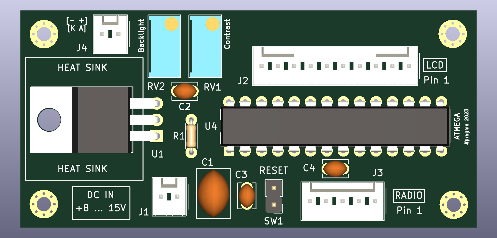

# Kenwood TM-V7 Display Mod

This repository contains a PCB design for a solution, to the "failing LCD display problem", by [OE9MKV](https://www.kinzi.net/node/16).
The implementation is based on reverse engineering some parts of the proprietary serial protocol from Kenwood.

The project uses KiCad 7 and the exported outputs are on the exports folder.

Includes schematic and PCB but you should refer to [OE9MKV](https://www.kinzi.net/node/16) and [PD2RLD](http://pd2rld.nl/) webpages for more
details, schematic, firmware, code and so on.

Thanks to both and in particular to [OE9MKV](https://www.kinzi.net/node/16) for all the effort in the development an implementation of a solution.

## Generated outputs

- [Check the Exports folder](exports/)

## Links

- [OE9MKV Webpage](https://www.kinzi.net/node/16)
- [PD2RLD Webpage](http://pd2rld.nl/) 
